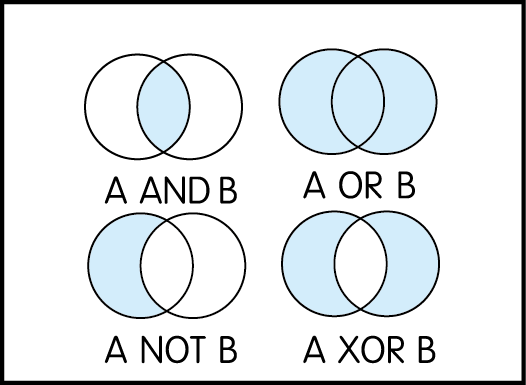
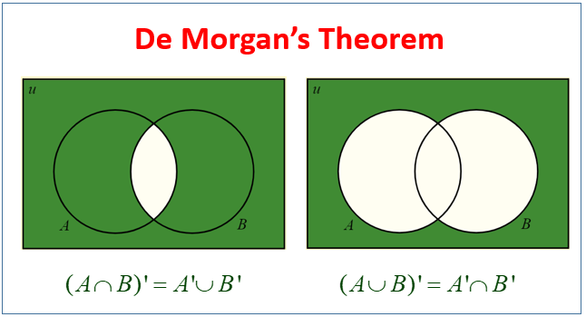

# Python: Week 2

## Review
> 複習一下上次的內容！

#### Variables (變數)
Variables are used to store data that can be referenced and manipulated in a program.
```python
age = 25            # Integer
height = 5.9        # Float
name = "John Doe"   # String
is_student = True   # Boolean
print(age, height, name, is_student)
```

#### `if` statements (`if` 敘述)
if statements are used to execute code based on conditions.x
```python
age = int(input("Enter your age: "))
if age >= 18:
    print("You are an adult.")
else:
    print("You are a minor.")
```

#### Arithmetic Operations (數學運算)
Python supports basic arithmetic operations.
```python
# Addition
print(5 + 3)  # Output: 8
# Subtraction
print(5 - 3)  # Output: 2
# Multiplication
print(5 * 3)  # Output: 15
# Division
print(5 / 3)  # Output: 1.6666666666666667
# Floor Division
print(5 // 3)  # Output: 1
# Modulus
print(5 % 3)  # Output: 2
# Exponentiation
print(5 ** 3)  # Output: 125
```


## Boolean (布林運算、邏輯運算)
> 電腦是 0 跟 1 的世界，也是「是」跟「否」的世界

Comparison operators are used to compare values.
```python
print(5 > 3)   
print(5 < 3)   
print(5 == 3)  
print(5 != 3)  
print(5 >= 3)  
print(5 <= 3)  
```

Logical operators are used to combine conditional statements.

```python
# and
print(True and False)  
# or
print(True or False)
# not
print(not True)
```

#### Task: How to derive XOR using Python
要怎麼才能得到 XOR 的結果呢?
```python
def xor(A, B):
    # Write your code here and return it
```


#### Task: Check the Demorgan’s rule (笛摩根定理)

```python
# Write your code here 
```

## Lists in Python
> 列表用來存一連串的東西
A list is a collection of items in a particular order. Lists can hold items of any data type, and the elements inside a list can be changed after the list has been created.


#### Task: Try it and break it!
> 試一試，然後來搞破壞吧！
```python
# Creating a list of fruits
fruits = ["apple", "banana", "cherry", "date"]
print(fruits)

# Accessing the first element in the list
print(fruits[0])  # Output: apple

# Adding an element to the end of the list
fruits.append("elderberry")
print(fruits)  # Output: ["apple", "banana", "cherry", "date", "elderberry"]

# Removing an element by its value
fruits.remove("banana")
print(fruits)  # Output: ["apple", "cherry", "date", "elderberry"]
```
1. 二個 list 可以相加嗎？ 可以相乘嗎？
2. `list` 可以乘上一個整數`int`嗎？乘上浮點數`float`呢？
3. `list` 的索引值可以是負數嗎？如果放`0:3`會得到什麼結果？


## `for` Loop in Python
> for 迴圈幫你重複做N次

A for loop is used for iterating over a sequence (like a list, tuple, dictionary, set, or string). With the for loop, you can execute a set of statements, once for each item in a list.

#### Task: Try it and break it!
> 試一試，然後來搞破壞吧！
```python
# Iterating through a list of fruits
for fruit in fruits:
    print(fruit)

# Printing numbers from 0 to 4
for i in range(5):
    print(i)
```

1. `range(2, 5)` 會得到什麼結果？
2. 把 `list(range(5))` 印出來得到什麼呢？
3. for 裡面再放一層 for 結果會怎麼樣？總共跑了幾次呢? 用一個變數數數看。


### while Loop in Python
> while 迴圈幫你重複做到停

A while loop repeatedly executes a target statement as long as a given condition is true.

#### Task: Try it and break it!
> 試一試，然後來搞破壞吧！
```python
# Printing numbers from 1 to 5
i = 1
while i <= 5:
    print(i)
    i += 1

# Using break to exit the loop
i = 1
while i <= 5:
    if i == 3:
        break
    print(i)
    i += 1
```

1. 可不可以用 `while` 做一個 `for` 呢?
2. 把`break`變成`continue`會怎麼樣?
3. `for` 迴圈裡面可以放 `break` 嗎?